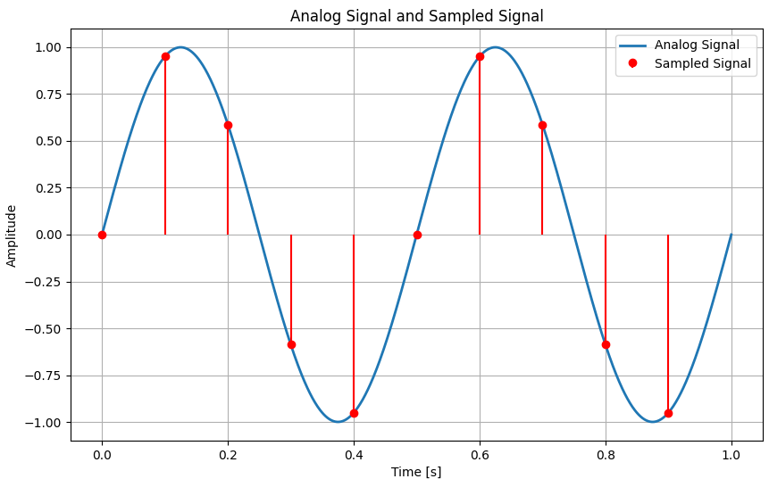
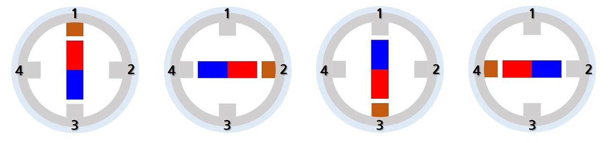
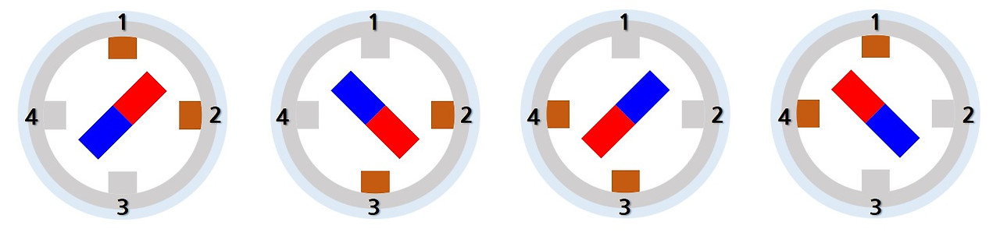
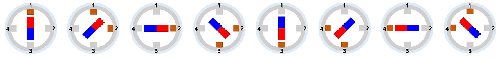

# Course Information  

- **Course Code:** ROB1001 
- **Course Title:** Basic Introduction to Robotics
- **Semester:** 2025-1
- **Instructor:** [Hyunsoo Shin](https://shs-vision.github.io)
- **Teaching Assistants:**  
  - Seongyeop Lee (ehfdlclsrn22@hanyang.ac.kr)  
  - Dohyeon Kim (kdh9904@hanyang.ac.kr)  

---

## Announcements  

This repository includes materials for the following weeks:  
- **Week 5:** Digital signal
- **Week 6:** Analog signal

### Duty

### Sampling frequency

### Resolution

- **Week 10:** Motor control - Stepper motor

### One phase on full step

### Two phase on full step

### One-two phases on half step

